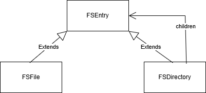
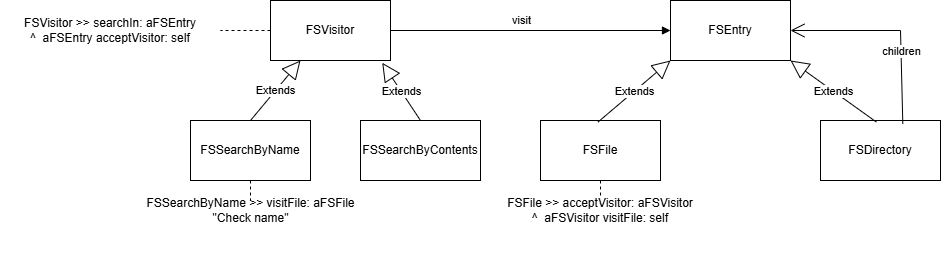

# C3P_Projects

C3P_Projects is a repository used during a course named C3P, meaning *Conception et Paradigmes de Programmation par la Pratique* (Design and Programming Paradigms through Practice).  
This project holds multiple small exercises done throughout the course.

## Loading the project

```smalltalk
Metacello new
	repository: 'github://LeoDefossez/C3P_Projects/src';
	baseline: 'C3PProject';
	load.
```

### Dice

This exercise was made to learn how to use double dispatch.  
A simple example of this is the message `+`.  
How can you add dice handles and dices without using conditionals?
How to implement this message : `Die new + (1 d: 20)`

```smalltalk
Die >> + aDiceElement

	^ aDiceElement plusDie: self

DieHandle >> plusDie: aDie

	^ self
		  addDie: aDie;
		  yourself
```

### Flags

This follows the tutorial available here : https://github.com/UnivLille-Meta/Miage-C3P/blob/2025/Resources/flags.pdf

Here’s a quick summary :

> In this tutorial, we will take a concrete approach to teach you some Pharo code.
>
> - You will learn how to draw a country shape using Roassal (a visualization engine).
> - In a second step, you will use an HTTP client to grab the flag of the coun- try based on its unique international id.
> - You will then define a small visual application using the Spec UI builder and it will display the country, its ID, and flag.

### MyAnimal

This exercise was made to challenge my understanding of message dispatch.
A simple example using a hook looks like this :

```smalltalk
MyAnimal >> food
 ^ 'I eat ', self alimentation

MyCat >>alimentation
^ 'fish'

 MyDog >> alimentation
^ 'everything my owner gives'
```

MyAnimal new food `message not understood error`  
 MyCat new food. `'I eat fish'`  
 MyDog new food. `'I eat everything my owner gives'`

### RockPaperScissors

Just like the dice exercise, this one focuses on learning double dispatch.
How do you implement `Scissors new vs: Rock new` or `Rock new vs: Scissors new` without conditionals ?  
Here's a simple exemple :

```smalltalk
Scissors >> vs: aRPSAction

	^ aRPSAction vsScissors: self

Rock >> vsScissors: aScissors

	^ self class name
```

### MyFileSystem

The objective of this exercise is to practice composite and visitor design patterns.  
The exercise is available here : https://github.com/UnivLille-Meta/Miage-C3P/blob/2025/Module08-Composite/2-Exercise.md  
Summary:

> Implement a file system following in a composite style.  
> The file system will have three main classes: `FSEntry`, `FSFile` and `FSDirectory`.  
> `FSFile` represents a file and a string as contents.  
> `FSDirectory` represents a directory and has a list of children.  
> `FSEntry` is an abstract superclass of both classes defining a name, like that both files and directories have a name.

This exercise requires the implementation of `FSDirectory` as the composite.  


For the second part of the exercise, we need to allow searching for files or directories either by name or by contents.  
A simple and scalable solution is to implement a visitor on `FSEntry` objects.  
Here the how it is done :  


The last part of the exercise requires adding new leaf types to the composite and additional visitors to show that this design is modular.  
(This has been done, but there’s no real need to go deeper into the details here.)
